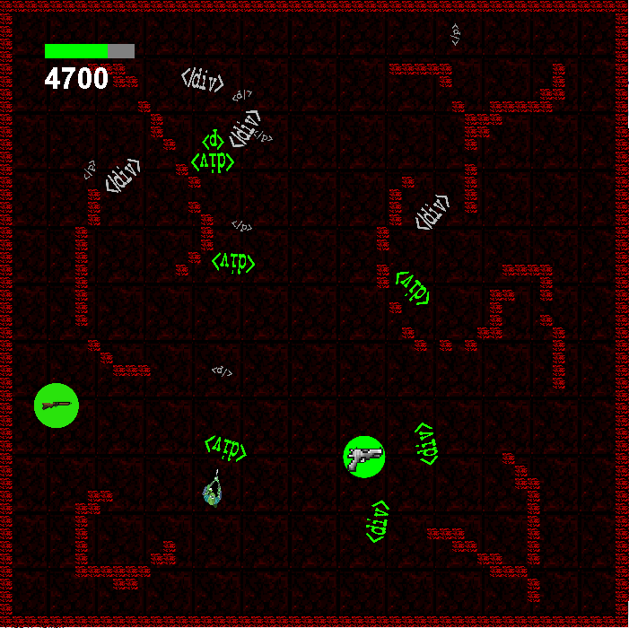

## About
**DOM** is a top-down 2D shooter written in Java as an optional project for university. Since this project had a relatively short deadline, I chose to import the concepts that I have learned while working on [roguelite-game](https://github.com/snoobism/roguelite-game) to Java. 

## Objective
The objective of the game is to ~~kill demons~~ collect unused DOM objects ... ***from HELL!***. At regular time intervals, enemies (DOM objects) are spawned. For each DOM object you collect you obtain points. You can also obtain points by picking up weapons or health. If your HP bar goes down to zero, game over.

## Controls
You move using WASD keys and aim/shoot using the mouse.

## Weapons
### Pistol

The pistol is the starting weapon of the player. It has a medium fire rate, it is very accurate and has high damage bullets. It can take out both type of enemies using a single shot. 

### Shotgun

The shotgun has a long fire rate, it is very innacurate and has low damage bullets, but shoots 7 bullets at a time. It can be useful for taking on multiple enemies at a time.

### Minigun

The minigun has a short fire rate, it is slightly innacurate and has low damage bullets. It can be useful for dealing with large groups of enemies. If you fire the minigun continuously it heats up and after a certain time you start taking damage ... really quickly. ***The excitement!***

